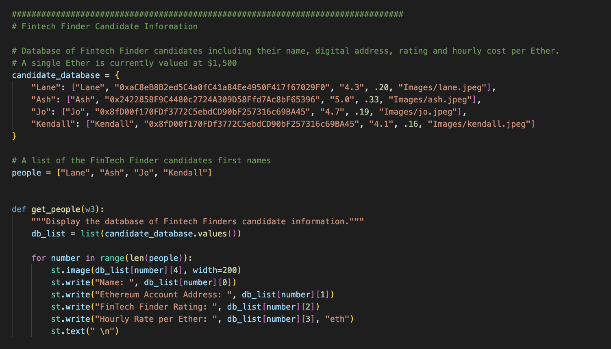

`Blockchain Wallet` You have been tasked with integrating the **Ethereum** *blockchain network into the application in order to enable your customers to instantly pay the fintech professionals whom they hire with `cryptocurrency`*.

[Click here](https://ethereum.org/en/developers/docs/transactions/) to learn more about Ethereum Transaction 🧠

## Ethereum Transaction
# Step 1 

* Import Ethereum Transaction Functions

# STEP 2

* Build a Database for your employees

# STEP 3   

* Sign and Execute a Payment Transaction

> This is the send transaction function 

> Executing transaction

# STREAMLIT

# VERIFY

* VERIFY TRANSACTION ON BLOCKCHAIN

## REQUIRMENTS
[PYTHON](https://www.python.org/downloads/)

[STREAMLIT](https://streamlit.io/)

[DOTENV](https://pypi.org/project/python-dotenv/)

[BIP44](https://pypi.org/project/bip44/)

[WEB3](https://pypi.org/project/web3/)

## INSTALLATION

[ZIP FILE](https://github.com/brprod8/Ether-Wallet-Ganache/archive/refs/heads/main.zip)

[CLONE REPO](https://github.com/brprod8/Ether-Wallet-Ganache.git)

## LICENSE

**Open to Experiemnt**

BY:Robert Smith

Credit:UC BERKELEY

Email : Roberts.track@yahoo.com

