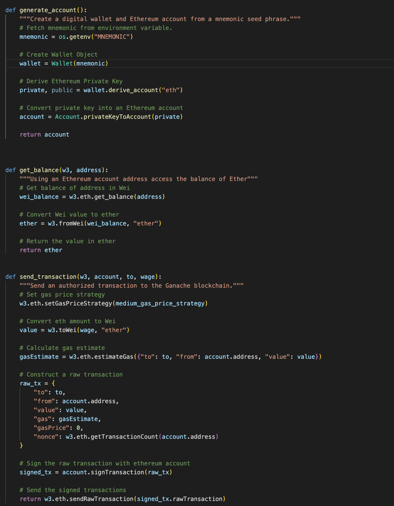

`Blockchain Wallet` You have been tasked with integrating the **Ethereum** *blockchain network into the application in order to enable your customers to instantly pay the fintech professionals whom they hire with `cryptocurrency`*.

[Click here](https://ethereum.org/en/developers/docs/transactions/) to learn more about Ethereum Transaction 🧠

## Ethereum Transaction
# Step1 

* Import Ethereum Transaction Functions

